# D · Diagrama AS-IS
## Atendimento ao Seguro-Desemprego · URA da Caixa Econômica Federal

> Baseado em `C_blueprint_asis.md` · Metodologia: Shostack
> `-->` fluxo principal · `-.->` fail point / dependência · `/…/` ponto de falha

---

```mermaid
flowchart LR

  %% ── ATORES ──────────────────────────────────────────
  CID([Cidadão])
  EMP([Empregador])

  %% ── PRÉ-ENCONTRO — PROCESSOS DE SUPORTE (E1) ───────
  ESOC[(eSocial / CAGED)]
  EWEB[Empregador Web · MTE]
  DTP[(DATAPREV · CNIS)]
  MTEH[MTE · Habilitação SD-Web]
  REQ[/Requerimento SD\]

  EMP -->|"envia desligamento"| ESOC
  EMP -->|"emite requerimento"| EWEB
  ESOC -->|"alimenta"| DTP
  EWEB -->|"gera"| REQ
  EWEB -->|"alimenta"| DTP
  DTP -->|"pré-habilita"| MTEH
  REQ -->|"entrega ao trabalhador"| CID

  %% ── E2 · ACESSA URA ─────────────────────────────────
  CTI[CTI / ACD · Caixa]
  URA[URA · 0800-726-0207]

  CID -->|"disca 0800"| URA
  CTI -->|"roteia chamada"| URA

  %% ── E3a · NAVEGA MENU ───────────────────────────────
  MENU[Menu DTMF]

  URA -->|"apresenta opções"| MENU
  MENU -->|"cidadão pressiona tecla"| AUTH

  %% ── E3b · AUTENTICA CPF/NIS ─────────────────────────
  AUTH[Autenticação CPF / NIS]
  API[(API MTE ↔ Caixa)]

  AUTH -->|"envia CPF/NIS"| API
  API -->|"retorna status"| AUTH
  MTEH -->|"habilita na base"| API

  %% ── E4 · CONSULTA E ORIENTAÇÃO ──────────────────────
  SBN[(Sistema de Benefícios · Caixa)]
  CONS[URA · Informa Status\ne Direcionamento]
  ATD[Atendente Humano · Caixa]

  AUTH -->|"autenticado"| CONS
  SBN -->|"sincroniza status"| CONS
  CONS -->|"status + protocolo"| CID
  CONS -->|"transfere"| ATD
  ATD -->|"orienta / resolve"| CID

  %% ── HANDOFF E5 · PAGAMENTO ──────────────────────────
  COMPE[COMPE / STR / PIX]
  CANAIS[App CAIXA Tem · ATM\nLotérica · CAIXA Aqui]

  CONS -->|"direciona → pagamento"| COMPE
  COMPE -->|"executa crédito"| CANAIS
  CANAIS -->|"saque / crédito"| CID

  %% ── HANDOFF E6 · RECURSO ────────────────────────────
  GOV[gov.br · CTPS Digital\nsistema SD/MTE]
  SRT[SRTE · Presencial]

  CONS -->|"direciona → recurso"| GOV
  CONS -->|"direciona → presencial"| SRT
  GOV -->|"resposta do recurso"| CID
  SRT -->|"atendimento presencial"| CID

  %% ── FAIL POINTS ─────────────────────────────────────
  FP4A[/⚠ FP-04a · Silêncio 2–4s\nAbandono de chamada/]
  FP4B[/⚠ FP-04b · CPF não reconhecido\nURA não informa causa/]
  FP05[/⚠ FP-05 · Loop sem saída\npara atendente humano/]
  FP06[/⚠ FP-06 · Status divergente\nMTE ↔ Caixa/]
  FP07[/⚠ FP-07 · Sem protocolo\ngerado ao fim da sessão/]
  FP1B[/⚠ FP-01b · DATAPREV off\nURA silencia ou derruba/]
  FP2B[/⚠ FP-02b · Vínculo não encontrado\nsem diagnóstico de causa/]

  API   -.->|"latência percebida\ncomo silêncio"| FP4A
  FP4A  -.->|"cidadão desliga"| CID

  API   -.->|"base inconsistente"| FP4B
  FP4B  -.->|"cidadão bloqueado"| CID

  MENU  -.->|"sem rota de escalonamento"| FP05
  FP05  -.->|"cidadão abandona"| CID

  SBN   -.->|"dado diverge do MTE"| FP06
  FP06  -.->|"informação falsa negativa"| CID

  CONS  -.->|"sessão encerra\nsem registro"| FP07
  FP07  -.->|"sem comprovante"| CID

  DTP   -.->|"DATAPREV indisponível"| FP1B
  FP1B  -.->|"URA sem contingência"| CID

  API   -.->|"vínculo não encontrado"| FP2B
  FP2B  -.->|"cidadão sem rota"| CID

  %% ── ESTILOS ─────────────────────────────────────────
  classDef fp   fill:#fff1f2,stroke:#b91c1c,color:#7f1d1d
  classDef ura  fill:#f0fdf4,stroke:#15803d,color:#14532d
  classDef sup  fill:#fefce8,stroke:#a16207,color:#713f12
  classDef ho   fill:#f5f3ff,stroke:#6d28d9,color:#3b0764

  class FP4A,FP4B,FP05,FP06,FP07,FP1B,FP2B fp
  class URA,MENU,AUTH,CONS,ATD ura
  class CTI,API,SBN,COMPE,CANAIS sup
  class GOV,SRT ho
```

